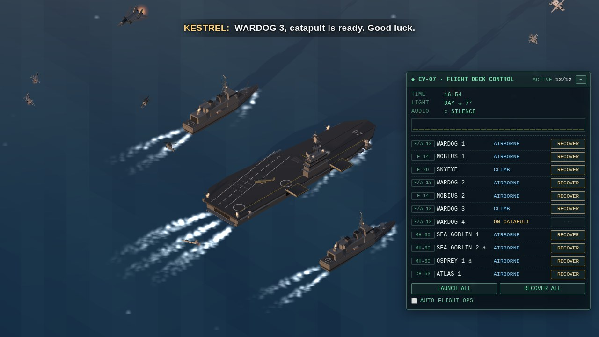

# Carrier Strike Group — web wallpaper for Wallpaper Engine

Isometric carrier strike group: a carrier, two escorting destroyers and a configurable air wing that
react to the music playing on your PC. Guns, CIWS and aircraft fire to the beat, Ace Combat style radio
subtitles run at the top of the screen, and the time of day follows your PC clock.



## Install

1. Copy the `CarrierWallpaper` folder into
   `...\Steam\steamapps\common\wallpaper_engine\projects\myprojects\`,
   or in Wallpaper Engine choose **Open Wallpaper → Open from File** and pick `project.json`.
2. Audio reaction needs audio recording enabled in the WE settings (it is on by default).
3. Panel buttons need mouse input enabled in WE. The mouse never moves the camera.

## Air wing

Aircraft counts are set in the wallpaper properties.

| Aircraft | Parked on deck |
|---|---|
| F/A-18 Hornet | outer wing panels fold up |
| F-14 Super Tomcat | variable sweep in flight, 75° oversweep when parked |
| F-35C Lightning II | outer wing panels fold up |
| E-2D Hawkeye (AWACS) | Sto-Wing: wings twist and fold back along the fuselage |
| MH-60 Seahawk / CH-53 Sea Stallion / AH-1Z Viper | rotor blades fold aft |
| CMV-22B Osprey (COD tiltrotor) | blades fold, nacelles tilt forward, the wing turns 90° to lie along the fuselage |

Each destroyer can also carry one MH-60 (optional).

- Three jets and one helicopter park on deck. Everything else lives in the hangar and uses the deck-edge elevators.
- Automatic flight ops work by flights (aircraft sharing a callsign): a four-ship flight launches as
  all four or as its lead pair (chosen at random), the second pair usually follows soon to join it,
  and flights are recovered together. About half of the air wing is airborne on average.
- Jets fly turn-radius-limited paths (Dubins curves), so launches, orbits and approaches use wide, realistic turns.
- Each flight picks its own random orbit distance (wingmen share the lead's); the far orbits run partly off-screen.
  Now and then a flight on station moves to a new distance, easing in and out smoothly.
- Landing gear retracts in flight.
- The CMV-22B takes off and lands vertically like a helicopter, then tilts its nacelles forward and raises
  its gear to cruise in airplane mode; it converts back as it slows down for landing.

## Radio subtitles

Ace Combat style lines appear at the top of the screen: catapult clearances, "call the ball", trap calls,
helicopter departures and landings, and combat chatter while music is playing.

- Callsigns come from Ace Combat 04 / 5 / Zero / 7 / 8:
  - **Squadrons:** Wardog, Razgriz, Mage, Spare, Strider (F/A-18), Mobius, Galm, Crow, Indigo, Wizard (F-14),
    Garuda, Scarface, Antares, Ogre, Saber (F-35C).
  - **Helicopters / COD:** Sea Goblin, Osprey, Halo (MH-60), Atlas, Hercules, Titan (CH-53), Viper, Cobra,
    Sweeper (AH-1Z), Sunhawk, Greyhound, Pelican (CMV-22B).
  - **AWACS:** SkyEye, Thunderhead, Eagle Eye, Long Caster, Bandog, Sky Keeper, Dealer.
  - **Ships:** carrier KESTREL, escorts BUCCANEER (port) and CUTLASS (starboard). The control panel
    lists them with their status (on station / engaging / damaged).
- Jets are grouped 4 per callsign, helicopters 2.
- As in Ace Combat, the speaker's callsign is shown on its own line above the line, colored by role
  (pilots, AWACS, ships, helicopters, aces).

## Missions

While there is no music, flights periodically leave the screen on missions (CAP, intercepts, escorts,
SAR, medevac, sonar searches…). Each mission has its own radio orders, and the flight returns to the orbit afterwards.

- Assembled flights (all aircraft up and on station) go first; a partly launched flight only goes when
  no flight is complete. A four-ship flight goes as all four or as one of its pairs, chosen at random;
  wingmen fly in trail.
- A pair left behind waits for the other pair to come back before the flight is sent again.
- The order addresses a whole flight through its lead (`WARDOG 1, proceed to…`) and part of a flight
  by each aircraft (`WARDOG 3, WARDOG 4, …`); the lead answers with one of many acknowledgements
  (common ones plus fighter / AWACS / helicopter flavoured), never the same twice in a row.
- Several flights can be away at once, but one flight always stays on station.
- The CMV-22B flies its own COD runs (mail, cargo, engine modules, passengers, medevac): it stays away longer
  and lands on the carrier when it comes back, reporting what it brought.
- The **Missions off-screen** property controls how often this happens (0 = off).
- Destroyer helicopters have their own callsigns: SEAHORSE and PETREL.

## Heavy music

Hits are detected both by loudness jumps and by spectral flux (rises in individual frequency bins), so
riffs and drums are caught even in dense, compressed mixes like metal and rock.

A "heaviness" meter (auto-gained loudness density) drives extra effects:

- **CIWS:** short bursts on detected hits, slightly longer when the mix is heavy.
  - Each mount rests 0.5–1 s after a burst.
  - New bursts start at most every 0.4 s, with at most 2 mounts firing at once.
- **Flak:** destroyer guns throw AA shells that burst in the sky on riffs and snares.
- **Missiles:** on big hits, the destroyers launch SM-2s vertically from their VLS cells and the carrier fires RAM salvos.
- **Flares:** now and then on the snare an aircraft on screen (air wing or fly-by jet) pops a few decoy flares
  that arc down trailing thin smoke — one burst at a time, more often when the music is heavy.
- **Camera shake** on heavy kicks — subtle, controlled by the **Camera shake on heavy hits** property.

## Air combat

When combat starts, the fighters (F/A-18, F-14, F-35C) and AH-1Z gunships leave their orbits and fly off-screen.
From there they keep coming back on **passes** across the screen, edge to edge, straight or curved:

- **Chase:** a bandit crosses the screen with our fighters on its tail; they fire missiles and guns on the beat.
- **Chased:** a bandit is on a fighter's six, shooting at it; the fighter pops flares (the bandit's missile goes
  for them), and its wingman comes in behind the bandit — or the AWACS calls the warning.
- **Sweep:** fighters pass over the fleet in formation.
- **Gunships** cross low: enemy fast attack boats run in to meet them and get Hellfires and rocket ripples (and
  shoot back); on cover passes they fire Sidewinders at passing bandits and the chin gun at vampires. While
  off-screen they report their attacks out there.
- The radio follows what is on screen: each pass is announced when it comes into view ("Su-33 at my twelve,
  I'm on him!", "Hang on, WARDOG 1, I'm on him!"), shots, flares, kills, escapes and thanks for the save.
- Our aircraft are never shot down. Dogfight bandits are left to the fighters (the ships don't fire at them).
- Unarmed aircraft (E-2D, MH-60, CH-53, CMV-22B) move out to a wide orbit, away from the fight.
- When the music stops, the fighters and gunships return to their orbits and the remaining boats turn and run.

## Enemies & hits

During combat, enemy fighters (bandits) make passes over the fleet, and anti-ship missiles (vampires)
skim in toward the ships.

- **Bandit types:** each wave is one flight of one type, and the radio names it in the contact report.

  | Type | Behaviour |
  |---|---|
  | Su-25 Frogfoot | slow, armoured (takes an extra hit), most likely to launch anti-ship missiles |
  | Su-33 Flanker | carrier-based fighter |
  | Su-47 Berkut | fast, forward-swept wings |
  | Su-57 Felon | fast stealth fighter |

  At low threat most waves are Su-25s and Su-33s; as stress builds, Su-47s and Su-57s take over.

- **Targeting:**
  - Guns track bandits (AA mode).
  - CIWS lock on vampires first.
  - Fighters, gunships, VLS and RAM fire homing missiles.
- **Boats:** fast attack craft come in across the water during gunship passes.
- **Hits:** a projectile that reaches its target scores on the **next beat** of the music. The target explodes, and shot-down bandits trail smoke and fall into the sea.
- **Ship damage:** missiles that leak through hit the ships, causing an explosion and a fire with smoke for a while.
- The **Enemy aircraft & missiles in combat** property turns all of this off.

## Stress / threat

Stress builds over ~10 minutes of continuous music and falls off in silence. The panel shows it as **THREAT**.

It changes:
- the radio tone (calm → tense → panic);
- the radio frequency;
- enemy wave size and spawn rate.

## Radio priority

During combat, combat calls go first (contacts, kills, vampires, damage). Routine deck calls switch to their
combat versions ("hot deck, launch, launch!") or are dropped if they get stale.

Urgent calls (unknown contacts, combat start, vampires, hits) cut in over a less important line, and
lines are shortened when others are waiting, so the radio keeps up with what happens on screen.

## Notification safeguard

Sound has to play continuously for 5 seconds before the fleet opens fire, so short notification sounds
never trigger it. The panel's STATUS line shows `ON PATROL` in silence, `UNKNOWN CONTACTS · Ns` while
arming and `COMBAT` once the fleet engages.

During those 5 seconds the radio reports unidentified radar contacts. If the sound stops early,
a "false alarm, stand down" call follows; otherwise combat begins.

## Deck parking

There are seven jet parking spots:
- forward of the island;
- starboard aft;
- on the angled-deck sponson, clear of the landing area.

After landing, a jet takes a free deck spot. It is struck below by elevator only when the deck is full, or
now and then for "maintenance".

## Hull number

The carrier hull number is a text property (deck, island and bow numbers, and the panel title).

## Adding a new aircraft type (for developers)

| File | What to do |
|---|---|
| `js/airframes.js` | write a builder returning `{ group, setFold(f), tick(dt, st) }`; call `mergeStatic(g, [...moving parts])` before returning |
| `js/aircraft.js` | subclass `FixedWing` or `Helicopter` with a static `spec` + `buildModel()`, add it to `AIRCRAFT_TYPES` and `FIXED_ORDER` / `HELI_ORDER` |
| `js/radio.js` | add a callsign pool under the same key |
| `project.json` | add a `<key>count` slider (read automatically in `main.js`), then run `python tools/gen_properties.py` |

After changing any JS/CSS file, bump the `?v=N` cache-buster in `index.html`.
More developer notes are in [`CLAUDE.md`](CLAUDE.md).

## Browser preview

Serve the folder and open it in a browser, for example:

```bash
python -m http.server 8765
```

then open `http://localhost:8765/`.

The **⚙ SETTINGS** button (top-left, browser only) shows:
- every Wallpaper Engine property;
- a demo beat — off by default, with tempo, loudness and silent gaps;
- **Play an audio file** — pick any audio file, and the wallpaper reacts to it exactly like it does to WE audio.

Settings are saved in `localStorage`; the audio file itself is not. **Reset all to defaults** clears them.

URL parameters still work and override stored values: `?hour=22`, `?zoom=150`, `?demo=1`.

If you add a property to `project.json`, run `python tools/gen_properties.py` to refresh `js/properties.js`.
